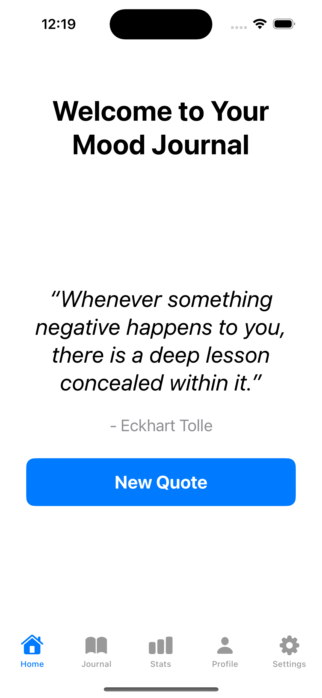
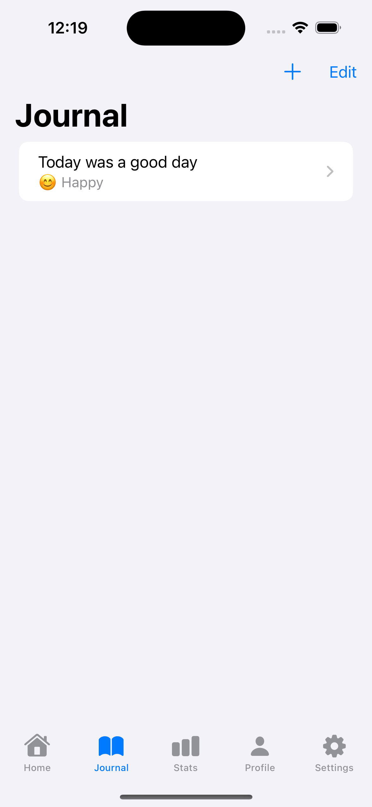
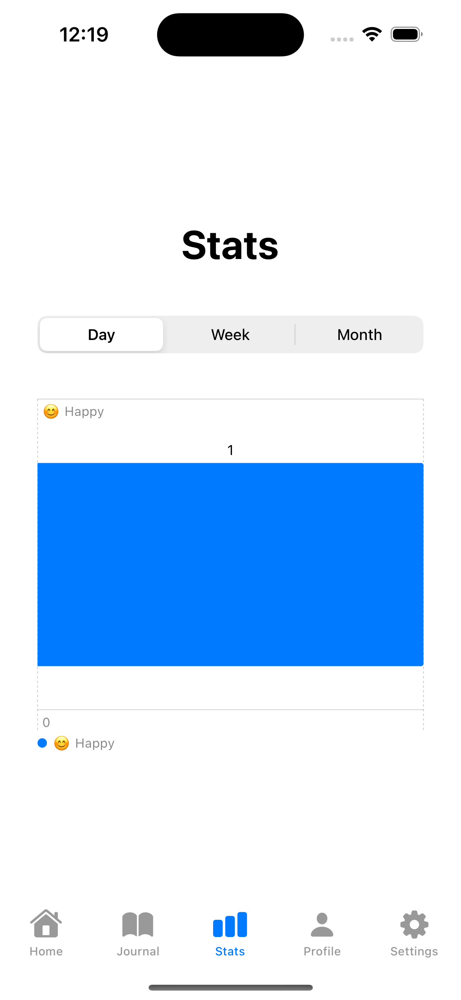
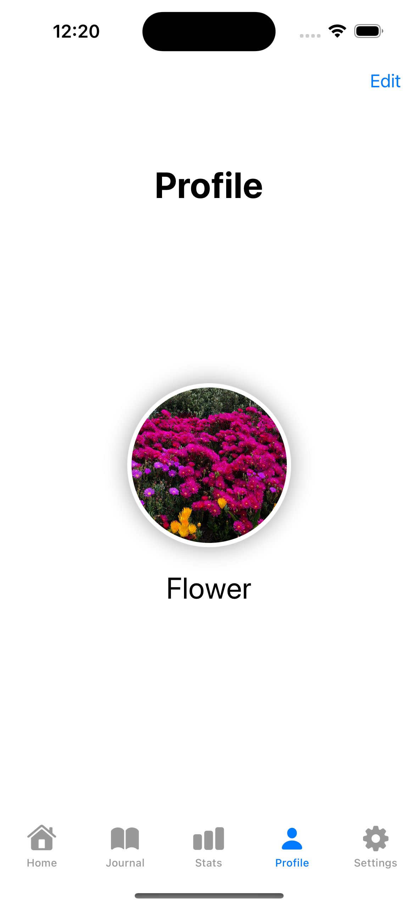
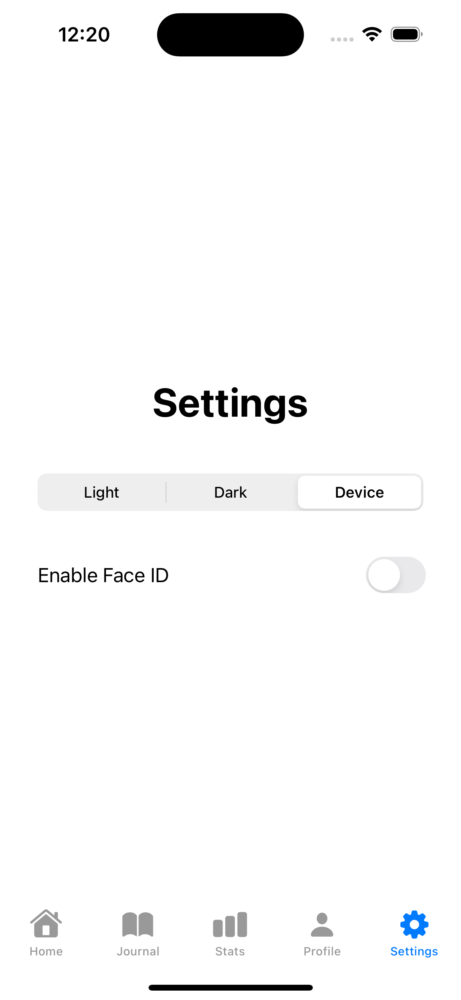

# Mood Journal

Welcome to the Mood Journal app! This is a SwiftUI-based iOS application designed to help you track your mood and activities. The app features a sleek and intuitive interface that allows you to log your emotions, view statistics, and keep a personal profile.

## Features

- **Mood Tracking**: Log your mood with notes and timestamps.
- **Statistics**: Visualize your mood data over time with interactive charts.
- **Profile Management**: Manage your profile with editable information and a profile picture.
- **Random Quotes**: Get inspired by a new quote every time you open the app.
- **Face ID Authentication**: Secure your app with Face ID.

## Screenshots







## Installation

1. **Clone the repository**:
    ```sh
    git clone https://github.com/Lasterminator/Mood_Journal.git
    ```

2. **Open the project**:
    Open `Mood-Journal.xcodeproj` in Xcode.

3. **Build and run the project**:
    Select your target device or simulator and click the run button in Xcode.

## Requirements

- iOS 14.0+
- Xcode 12.0+
- Swift 5.3+

## Usage

### Home Screen

- View a welcome message and a random quote.
- Tap the "New Quote" button to generate a new random quote.

### Journal Screen

- Log your mood with notes and timestamps.
- Add, edit, or delete entries from your journal.

### Stats Screen

- Visualize your mood data with interactive charts.
- Select different time frames to filter the data.

### Profile Screen

- View and edit your profile information.
- Change your profile picture and username.

### Settings Screen

- Adjust your sleep time.
- Toggle Face ID authentication.
- Change the app theme (Light, Dark, or System default).

## Contributing

We welcome contributions! If you find a bug or want to add a new feature, feel free to open an issue or submit a pull request.

1. **Fork the repository**.
2. **Create a new branch**: `git checkout -b feature-branch`
3. **Make your changes and commit them**: `git commit -m 'Add new feature'`
4. **Push to the branch**: `git push origin feature-branch`
5. **Open a pull request**.

## License

This project is licensed under the MIT License. See the [LICENSE](LICENSE) file for more details.

## Acknowledgements

- [Quotable](https://quotable.io/) for the quotes API.

## Contact

If you have any questions or feedback, please contact me at [your-email@example.com].

---

Thank you for using Mood Journal!
